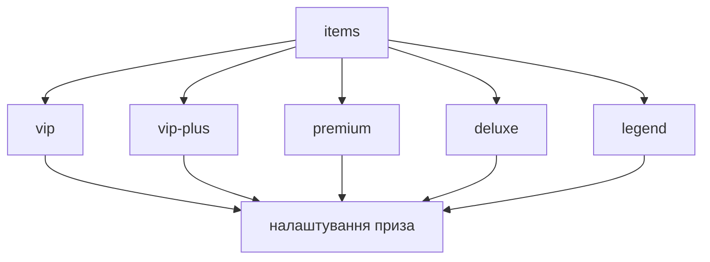

Налаштування призів відбувається у файлі `items.yml`. Перейдемо до його структури.

## Структура



Поглянемо на відрізок налаштування приза `vip` зі стандартного файлу конфігурації кейсу `default`
```yaml
items:
  vip:
    group: vip
    chance: 30
    material:
      id: YELLOW_WOOL
      display-name: '&eVIP'
      enchanted: false
    index: 0
    give-type: ONE
    actions:
      - '[command] lp user %player% parent set %group%'
      - '[title] &aCongratulations!;&5you won %groupdisplayname%'
      - '[broadcast] &a>&c>&e> &c%player% &6won a donate %groupdisplayname% &6from %casedisplayname%'
    alternative-actions:
      - "[message] &cI'm sorry %player%, but you have group a stronger group than you won:("
    random-actions:
      first:
        chance: 50
        display-name: "something"
        actions:
          - '[command] say something'
          - '[broadcast] &a>&c>&e> &c%player% &6won a donate %groupdisplayname% &6from %casedisplayname%'
      second:
        chance: 50
        actions:
          - '[command] say something'
          - '[broadcast] &a>&c>&e> &c%player% &6won a donate %groupdisplayname% &6from %casedisplayname%'
```

Виглядає досить-таки складно, розберемо кожен параметр окремо.

## Параметри

### `group`
> Група, що буде перевірятись в [`level-groups`](../Cases#level-groups)\
> Задається для заповнювача `%group%`\
> Дивитись також: [`alternative-actions`](#alternative-actions)

:::note
При видаленні цього параметру, група не буде перевірятись на [`level-groups`](../Cases#level-groups)
:::
```yaml
group: vip
```

### `chance`
> Шанс, з яким гравець може виграти приз\
> Не залежить від загальної суми `100%`, загальна сума може бути будь-якою (`vip` - `70%`, `premium` - `30%`, `deluxe` - `10%` - загальна сума `110%`)
```yaml
chance: 30
```

### `material`
> Предмет, що буде відображатись в анімації, історії відкриттів та [DCPrizePreview](https://www.spigotmc.org/resources/dcprizepreview-donatecase-addon.119445/)

#### `id`
> Айді [матеріалу предмета](../../materials)
```yaml
id: YELLOW_WOOL
```

#### `display-name`
> Відображуване ім'я предмета
```yaml
display-name: '&eVIP'
```

#### `enchanted` (необов'язково)
> Перемикає зачарованість предмету
```yaml
enchanted: false
```

#### `lore` (необов'язково)
> Задає опис предмету\
> Використовується лише для меню та [DCPrizePreview](https://www.spigotmc.org/resources/dcprizepreview-donatecase-addon.119445/)
```yaml
lore:
  - '&cSome cool description'
```

#### `model-data` (необов'язково)
> Задає користувацькі данні моделі (CustomModelData)
```yaml
model-data: 1234
```

#### `rgb` (необов'язково)
> Задає колір шкіряних предметів
```yaml
rgb: 123, 50, 15
```

### `index` (необов'язково)
> Задає індекс для сортування призів в анімаціях та [DCPrizePreview](https://www.spigotmc.org/resources/dcprizepreview-donatecase-addon.119445/)
```yaml
index: 0
```

### `give-type`
> Задає тип видачі приза\
> Доступні параметри: `ONE` - виконання [статичного списку дій](#actions), `RANDOM` - виконання [випадкового списку дій](#random-actions) зі своїми шансами\
> За замовчуванням `ONE`
```yaml
give-type: ONE
```

### `actions`
> Список дій для видачі приза\
> Спрацьовує, якщо [`give-type`](#give-type) встановлено на `ONE`\
> Дивитись також: [Дії](./actions)
```yaml
actions:
  - '[command] lp user %player% parent set %group%'
  - '[title] &aCongratulations!;&5you won %groupdisplayname%'
  - '[broadcast] &a>&c>&e> &c%player% &6won a donate %groupdisplayname% &6from %casedisplayname%'
```

### `random-actions`
> Випадкова мапа дій для видачі приза\
> Спрацьовує, якщо [`give-type`](#give-type) встановлено на `RANDOM`\
> Дивитись також: [Дії](./actions)

:::info
Може бути корисним для видачі груп на певний період часу, коли варто розділити приз на різні дії
:::
```yaml
    random-actions:
      first:
        chance: 50
        display-name: "something"
        actions:
          - '[command] say something'
          - '[broadcast] &a>&c>&e> &c%player% &6won a donate %groupdisplayname% &6from %casedisplayname%'
      second:
        chance: 50
        actions:
          - '[command] say something'
          - '[broadcast] &a>&c>&e> &c%player% &6won a donate %groupdisplayname% &6from %casedisplayname%'
```

#### `chance`
> Шанс, з яким буде виконано дію
```yaml
chance: 50
```

#### `display-name` (необов'язково)
> Відображуване ім'я дії для заповнювачів
```yaml
display-name: "something"
```

#### `actions`
> Список дій для видачі приза\
> Дивитись також: [Дії](./actions)
```yaml
actions:
  - '[command] say something'
  - '[broadcast] &a>&c>&e> &c%player% &6won a donate %groupdisplayname% &6from %casedisplayname%'
```

#### `alternative-actions`
> Список дій, що відбуваються, якщо гравець отримав нижчу або рівну собі групу відповідаючи параметрам [`level-groups`](../Cases#level-groups)
```yaml
alternative-actions:
  - "[message] &cI'm sorry %player%, but you have group a stronger group than you won:("
```

## Заповнювачі

Заповнювачі (placeholders) використовуються при виконанній дій для заміни певної інформаці.

| Заповнювач                 | Опис                             |
|----------------------------|----------------------------------|
| `%player%`                 | Ім'я гравця                      |
| `%group%`                  | Назва групи (приза)              |
| `%groupdisplayname%`       | Відображуване ім'я групи (приза) |
| `%casetype%`               | Тип кейсу                        |
| `%casedisplayname%`        | Відображуване ім'я кейсу         |
| `%animation%`              | Назва анімації                   |